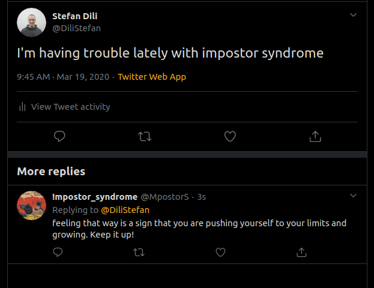

> impostor_syndrome_bot

# Description

- A twitter bot that recieves live streaming of new tweets, detects the ones containing the keywords "impostor syndrome" and replies with a cheerful comment.

# Built With

- Ruby
- Twitter gem

## Authors

👤 **Author**
Stefan Dili

[@github](https://github.com/dili021)

[@twitter](https://twitter.com/dilistefan)

[@linkedin](https://linkedin.com/in/stefan-dili)

## Making this project your own

- First fork the repo and download to your machine. You will need the bundler, twitter, and dotenv gems for this project. To install them run `gem install bundler` in your terminal, and then run `bundle install` to install the other gems from the Gemfile. You will also need to register for a Twitter developer account and copy your API keys from their platform into your .env file following the .env.template. Open the project in your code editor, edit the keyword and responce to what you'd like, deploy on a app hosting platform like heroku and run it.

## 🤝 Contributing

- Contributions, issues and feature requests are welcome!

## Show your support

- Give a ⭐️ if you like this project!

## Acknowledgments

- Hat's off to [Microverse](https://www.microverse.org) and [The Odin Project](https://theodinproject.com) for the study materials

